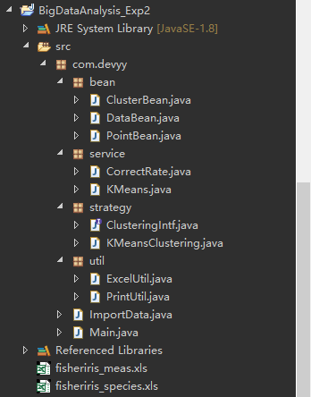
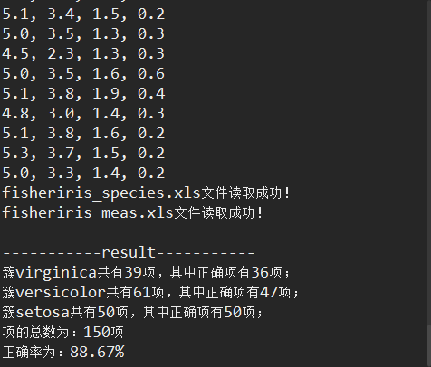

# 实时大数据分析实验二——MapReduce下的k-means算法
## 一、实验内容

给定国际通用UCI数据库中FISHERIRIS数据集，其meas集包含150个样本数据，每个数据含有莺尾属植物的4个属性，即萼片长度、萼片宽度、花瓣长度，单位为cm。上述数据分属于species集的三种setosa、versicolor和virginica花朵类别。
要求在该数据集上用MapReduce结构实现k-means聚类算法，得到的聚类结果与species集的Label结果比较，统计这两类算法聚类的正确率和运行时间。

    附件：Fisheriris数据集：
	① fisheriris_meas.xls ( 莺尾花4个属性值 )
	② fisheriris_species.xls ( fisheriris_meas.xls中每条数据相应的类别Label值 )

## 二、实验设计（原理分析及流程）

（1）聚类定义：

将数据集划分为由若干相似对象组成的多个组(group)或簇(cluster)的过程，使得同一组中对象间的相似度最大化，不同组中对象间的相似度最小化。

聚类是一种无监督的机器学习方法，即事先对数据集的分布没有任何了解，是将物理或抽象对象的集合组成为由类似的对象组成的多个组的过程。

（2）聚类分析任务步骤：

①模式表示（包括特征提取和选择）

②适合于数据领域的模式相似性定义

③聚类或划分算法

④数据摘要

⑤输出结果的评估

（3）k-means算法：

首先，随机选择k个对象，每个对象代表一个簇的初始均值或中心；对剩余的每个对象，根据其与各簇中心的距离，将它指派到最近或最相似的簇，然后计算每个簇的新均值，得到更新后的簇中心；不断重复，直到准则函数收敛。

## 三、实验代码及数据记录
### 1.代码 
#### 1.0 文件结构图

#### 1.1 ClusterBean.java

	package com.devyy.bean;
	
	import java.util.List;
	
	/** 
	 * 簇实体，封装了簇心和该簇中的簇内元素集 
	 * 
	 * @author ZYY
	 * 
	 */  
	public class ClusterBean {
		private String clusterid;
		private Double[] clusterCenter;// 簇心
		private List<PointBean> pointList;// 簇内元素
	
		public String getClusterid() {
			return clusterid;
		}
	
		public void setClusterid(String clusterid) {
			this.clusterid = clusterid;
		}
	
		public Double[] getClusterCenter() {
			return clusterCenter;
		}
	
		public void setClusterCenter(Double[] clusterCenter) {
			this.clusterCenter = clusterCenter;
		}
	
		public List<PointBean> getPointList() {
			return pointList;
		}
	
		public void setPointList(List<PointBean> pointList) {
			this.pointList = pointList;
		}
	}

#### 1.2 DataBean.java

	package com.devyy.bean;
	
	import java.util.List;
	
	/** 
	 * DataBean实体类，封装了簇的list以及数据点集的list 
	 * 
	 * @author ZYY
	 * 
	 */ 
	public class DataBean {
		private List<ClusterBean> clusterList;// 簇
		private List<PointBean> pointList;// 数据点集
	
		public List<ClusterBean> getClusterList() {
			return clusterList;
		}
	
		public void setClusterList(List<ClusterBean> clusterList) {
			this.clusterList = clusterList;
		}
	
		public List<PointBean> getPointList() {
			return pointList;
		}
	
		public void setPointList(List<PointBean> pointList) {
			this.pointList = pointList;
		}
	}

#### 1.3 PointBean.java

	package com.devyy.bean;
	
	
	/** 
	 * 数据点实体，封装了具体的Cell中每行的数据点的具体的double值，以及数据点所在的簇和该簇的簇名 
	 * 
	 * @author ZYY
	 * 
	 */  
	public class PointBean {
		private Double[] point;// 数据点
		private String clusterid;// 数据点所在的簇
		private String pointName;// 给数据点所对应的簇名
	
		public Double[] getPoint() {
			return point;
		}
	
		public void setPoint(Double[] point) {
			this.point = point;
		}
	
		public String getClusterid() {
			return clusterid;
		}
	
		public void setClusterid(String clusterid) {
			this.clusterid = clusterid;
		}
	
		public String getPointName() {
			return pointName;
		}
	
		public void setPointName(String pointName) {
			this.pointName = pointName;
		}
	}

#### 1.4 CorrectRate.java

	package com.devyy.service;
	
	import java.text.DecimalFormat;
	import java.util.HashMap;
	import java.util.HashSet;
	import java.util.Iterator;
	import java.util.List;
	import java.util.Map;
	import java.util.Map.Entry;
	import java.util.Set;
	
	import com.devyy.ImportData;
	import com.devyy.bean.ClusterBean;
	import com.devyy.bean.DataBean;
	import com.devyy.bean.PointBean;
	
	import jxl.Cell;
	
	public class CorrectRate {
		
		private ImportData importData =new ImportData();
		
		/**
		 * 获得两个Excel表之间的正确的映射
		 * @return 返回键值对map
		 */
		public Map<Double[], String> getMap() {
			List<Cell[]> resultCellList = importData.importResultData();
			List<Cell[]> testCellList = importData.importData();
			Map<Double[], String> map = new HashMap<Double[], String>();
			for (int j = 0; j < testCellList.size(); j++) {
				Cell[] testCell = testCellList.get(j);
				Cell[] resultCell = resultCellList.get(j);
				String name = resultCell[0].getContents();
				Double[] cellValue = new Double[testCell.length];
				for (int i = 0; i < testCell.length; i++) {
					cellValue[i] = Double.valueOf(testCell[i].getContents());
				}
				map.put(cellValue, name);
			}
			return map;
		}
	
		/**
		 * 获得正确率
		 * @param dataBean
		 */
		public void getCorrectRate(DataBean dataBean) {
			int maxLoca = 0;// 最多项在数组中出现的位置
			int maxSize = 0;// 最多项出现的次数
			int sum = 0;// 正确项的总和
			Map<Double[], String> map = getMap();
			// 每个簇所获得的簇名
			String[] clusterNameReal = new String[dataBean.getClusterList().size()];
			Set<String> set = new HashSet<String>();
			for (Iterator<Entry<Double[], String>> iter = map.entrySet().iterator(); iter.hasNext();) {
				Map.Entry<Double[], String> entry = iter.next();
				String value = entry.getValue();
				set.add(value);
			}
			// 封装簇名
			String[] clusterNameArray = set.toArray(new String[dataBean.getClusterList().size()]);
			int[] countArray = new int[clusterNameArray.length];
			// 每个簇正确项个数的数组
			int[] correctArray = new int[clusterNameArray.length];
			for (int j = 0; j < countArray.length; j++) {
				correctArray[j] = 0;
			}
			List<ClusterBean> clusterList = dataBean.getClusterList();
			// 遍历每个簇，根据簇中元素所属于正确结果的最多值定一个初始的簇类
			for (int i = 0; i < clusterList.size(); i++) {
				// 计数器初始化
				for (int j = 0; j < countArray.length; j++) {
					countArray[j] = 0;
				}
				// 最多项出现的次数初始化
				maxSize = 0;
				// 簇中元素的List
				List<PointBean> pointList = clusterList.get(i).getPointList();
				// 遍历簇内元素，得到该簇的真实名字
				for (int j = 0; j < pointList.size(); j++) {
					String valueStr = "";
					Double[] testDoubleArray = dataBean.getClusterList().get(i).getPointList().get(j).getPoint();
					Set<Double[]> valueSet = map.keySet();
					int temp = 0;
					for (Iterator<Double[]> iter = valueSet.iterator(); iter.hasNext();) {
						int countSame = 0;
						Double[] valueArray = iter.next();
						for (int m = 0; m < valueArray.length; m++) {
							if (valueArray[m].doubleValue() == testDoubleArray[m].doubleValue()) {
								countSame++;
							}
						}
						if (countSame == valueArray.length) {
							valueStr = map.get(valueArray);
							dataBean.getPointList().get(temp).setPointName(valueStr);
							dataBean.getClusterList().get(i).getPointList().get(j).setPointName(valueStr);
							break;
						}
						temp++;
					}
					for (int m = 0; m < clusterNameArray.length; m++) {
						if (clusterNameArray[m].equals(valueStr)) {
							countArray[m]++;
						}
					}
				}
				for (int z = 0; z < countArray.length; z++) {
					if (countArray[z] >= maxSize) {
						maxSize = countArray[z];
						maxLoca = z;
					}
				}
				clusterNameReal[i] = clusterNameArray[maxLoca];
				correctArray[i] = maxSize;
			}
			
			System.out.println();
			System.out.println("-----------result-----------");
			for (int i = 0; i < correctArray.length; i++) {
				sum += correctArray[i];
				System.out.println("簇" + clusterNameReal[i] + "共有" + dataBean.getClusterList().get(i).getPointList().size()
						+ "项，其中正确项有" + correctArray[i] + "项；");
			}
			System.out.println("项的总数为：" + dataBean.getPointList().size() + "项");
			double result = sum * 1.0 / dataBean.getPointList().size() * 100;
			DecimalFormat df = new DecimalFormat("0.00");
			System.out.println("正确率为：" + df.format(result) + "%");
		}
	}

#### 1.5 KMeans.java

	package com.devyy.service;
	
	import java.util.ArrayList;
	import java.util.List;
	import java.util.UUID;
	
	import com.devyy.bean.ClusterBean;
	import com.devyy.bean.DataBean;
	import com.devyy.bean.PointBean;
	
	import jxl.Cell;
	
	/** 
	 * K-Means算法 
	 * 
	 * @author ZYY
	 * 
	 */  
	public class KMeans {
		// 定义最大欧式距离为5000
		public static final double MAXLENGTH = 5000.0;
	
		/**
		 * 计算新的簇中心
		 * @param dataBean——DataBean实体类
		 * @return 更新后的DataBean实体
		 */
		public DataBean countClusterCenter(DataBean dataBean) {
			List<ClusterBean> clusterList = dataBean.getClusterList();
			List<ClusterBean> newClusterList = new ArrayList<ClusterBean>();
			int i, j, p;
			for (i = 0; i < clusterList.size(); i++) {
				ClusterBean cluster = clusterList.get(i);
				List<PointBean> pointList = cluster.getPointList();
				Double[] countArray = new Double[clusterList.get(0).getPointList().get(0).getPoint().length];
				for (j = 0; j < countArray.length; j++) {
					countArray[j] = 0.0;
				}
				for (j = 0; j < pointList.size(); j++) {
					PointBean point = pointList.get(j);
					Double[] pointValue = point.getPoint();
					for (p = 0; p < pointValue.length; p++) {
						countArray[p] = pointValue[p] + countArray[p];
					}
				}
				for (j = 0; j < countArray.length; j++) {
					countArray[j] /= pointList.size();
				}
				cluster.setClusterCenter(countArray);
				newClusterList.add(cluster);
			}
			dataBean.setClusterList(newClusterList);
			return dataBean;
		}
	
		/**
		 * 将对象指派到与其距离最近的簇
		 * @param dataBean——DataBean实体
		 * @param pointBean——数据点
		 * @return 修改后的dataBean实体
		 */
		public DataBean distributeIntoCluster(DataBean dataBean, PointBean pointBean) {
			double sum = 0.0, max = MAXLENGTH;
			// loca存放在原先簇中的位置，locaRecord存放是在哪个簇
			int locaRecord = 0, loca = 0;
			int i, j, count, n, m;
			List<ClusterBean> clusterList = dataBean.getClusterList();
			List<PointBean> pointList = dataBean.getPointList();
			List<PointBean> clusterPointList = null;
			Double[] distanceArray = new Double[clusterList.size()];
			// 获取数据点内容
			Double[] pointValueArray = pointBean.getPoint();
			Double[] tempArray = new Double[pointValueArray.length];
			// 遍历每一个簇
			for (i = 0; i < clusterList.size(); i++) {
				sum = 0.0;
				// 得到该簇的中心点
				Double[] clusterCenter = clusterList.get(i).getClusterCenter();
				// 将平方值保存在一个temp数组
				for (j = 0; j < pointValueArray.length; j++) {
					tempArray[j] = Math.pow(clusterCenter[j] - pointValueArray[j], 2);
				}
				// 求欧式距离
				for (j = 0; j < tempArray.length; j++) {
					sum += tempArray[j];
				}
				// 将结果保存在距离数组中
				distanceArray[i] = Math.sqrt(sum);
			}
			// 遍历距离数组，找到要插入的簇
			for (i = 0; i < distanceArray.length; i++) {
				if (distanceArray[i] < max) {
					max = distanceArray[i];
					locaRecord = i;
				}
			}
			// 获得该簇
			ClusterBean cluster = clusterList.get(locaRecord);
			// 找到簇中的该元素
			for (i = 0; i < pointList.size(); i++) {
				if (pointList.get(i).equals(pointBean)) {
					loca = i;
					break;
				}
			}
			// 在同一个簇，不做任何处理
			if (cluster.getClusterid().equals(pointBean.getClusterid())) {
				return dataBean;
			}
			// 这个数据不在任何一个簇，加进来
			else if (pointBean.getClusterid() == null) {
				clusterPointList = cluster.getPointList();
			}
			// 在不同的簇中
			else {
				clusterPointList = cluster.getPointList();
				// 遍历每个簇，找到该元素
				for (i = 0; i < clusterList.size(); i++) {
					boolean flag = false;
					// 遍历每个簇中元素
					for (m = 0; m < clusterList.get(i).getPointList().size(); m++) {
						PointBean everypoint = clusterList.get(i).getPointList().get(m);
						Double[] everypointValue = everypoint.getPoint();
						count = 0;
						for (n = 0; n < everypointValue.length; n++) {
							if (pointValueArray[n].doubleValue() == everypointValue[n].doubleValue()) {
								count++;
							}
						}
						if (count == everypointValue.length) {
							clusterList.get(i).getPointList().remove(m);
							flag = true;
							break;
						}
					}
					if (flag) {
						break;
					}
				}
			}
			// 设置数据点的所在簇位置
			pointBean.setClusterid(cluster.getClusterid());
			// 更新dataBean中的数据点信息
			pointList.set(loca, pointBean);
			// 将数据点加入到簇的数据点集中
			clusterPointList.add(pointBean);
			// 将数据点集加入到簇中
			cluster.setPointList(clusterPointList);
			// 更新dataBean中的簇信息
			clusterList.set(locaRecord, cluster);
			// 将簇信息放入dataBean中
			dataBean.setClusterList(clusterList);
			// 将数据点集信息放入到dataBean中
			dataBean.setPointList(pointList);
			return dataBean;
		}
	
		/**
		 * 初始化DataBean
		 * @param cellList——封装了Excel表中一行行数据的list
		 * @param k——k-means算法中的k
		 * @return 修改后的DataBean实体
		 */
		public DataBean initDataBean(List<Cell[]> cellList, int k) {
			int i, j;
			DataBean dataBean = new DataBean();
			List<PointBean> pointList = new ArrayList<PointBean>();
			List<ClusterBean> clusterList = new ArrayList<ClusterBean>();
			List<ClusterBean> newClusterList = new ArrayList<ClusterBean>();
			Cell[] cell = new Cell[cellList.get(0).length];
			// 将所有元素加入到DataBean中管理以及加入PointBean中
			for (i = 0; i < cellList.size(); i++) {
				cell = cellList.get(i);
				Double[] point = new Double[cellList.get(0).length];
				for (j = 0; j < cell.length; j++) {
					point[j] = Double.valueOf(cell[j].getContents());
				}
				PointBean pointBean = new PointBean();
				pointBean.setPoint(point);
				pointBean.setPointName(null);
				if (i < k) {
					String clusterid = UUID.randomUUID().toString();
					pointBean.setClusterid(clusterid);
					ClusterBean cluster = new ClusterBean();
					cluster.setClusterid(clusterid);
					clusterList.add(cluster);
				} else {
					pointBean.setClusterid(null);
				}
				pointList.add(pointBean);
			}
			dataBean.setPointList(pointList);
			// 将前k个点作为k个簇
			for (i = 0; i < k; i++) {
				cell = cellList.get(i);
				Double[] point = new Double[cellList.get(0).length];
				for (j = 0; j < cell.length; j++) {
					point[j] = Double.valueOf(cell[j].getContents());
				}
				ClusterBean cluster = clusterList.get(i);
				cluster.setClusterCenter(point);
				List<PointBean> clusterPointList = new ArrayList<PointBean>();
				PointBean pointVO = new PointBean();
				pointVO.setPoint(point);
				clusterPointList.add(pointVO);
				cluster.setPointList(clusterPointList);
				newClusterList.add(cluster);
			}
			dataBean.setClusterList(newClusterList);
			return dataBean;
		}
	}

#### 1.6 ClusteringIntf.java

	package com.devyy.strategy;
	
	public interface ClusteringIntf {
		// 策略抽象接口	 
		public void clusterAlgorithm();
	}

#### 1.7 KMeansClustering.java

	package com.devyy.strategy;
	
	import java.util.ArrayList;
	import java.util.List;
	
	import com.devyy.ImportData;
	import com.devyy.bean.DataBean;
	import com.devyy.bean.PointBean;
	import com.devyy.service.CorrectRate;
	import com.devyy.service.KMeans;
	import com.devyy.util.PrintUtil;
	
	import jxl.Cell;
	
	/** 
	 * 使用K-Means算法 
	 * 
	 * @author ZYY
	 * 
	 */  
	public class KMeansClustering implements ClusteringIntf {
		private KMeans kMeans = new KMeans();
		private ImportData importData =new ImportData();
		private PrintUtil printUtil  =new PrintUtil();
		private CorrectRate correctRate =new CorrectRate();	
		
		// 调用K-Means算法	 
		@Override
		public void clusterAlgorithm() {
			List<Cell[]> cellList = importData.importData();
			int clusterNumber = importData.getclusterNumber();
			DataBean dataBean = kMeans.initDataBean(cellList, clusterNumber);
			List<PointBean> pointList = dataBean.getPointList();
			int count = clusterNumber;
			List<Double[]> centerValueList = new ArrayList<Double[]>();
			for (int i = 0; i < clusterNumber; i++) {
				Double[] center = dataBean.getClusterList().get(i).getClusterCenter();
				centerValueList.add(center);
			}
			while (count != 0) {
				count = 0;
				for (int i = 0; i < pointList.size(); i++) {
					dataBean = kMeans.distributeIntoCluster(dataBean, dataBean.getPointList().get(i));
				}
				dataBean = kMeans.countClusterCenter(dataBean);
				List<Double[]> newCenterValueList = new ArrayList<Double[]>();
				for (int i = 0; i < clusterNumber; i++) {
					Double[] center = dataBean.getClusterList().get(i).getClusterCenter();
					newCenterValueList.add(center);
				}
				for (int i = 0; i < clusterNumber; i++) {
					Double[] oldCenter = centerValueList.get(i);
					Double[] newCenter = newCenterValueList.get(i);
					for (int j = 0; j < oldCenter.length; j++) {
						// 控制误差的精确度范围在0.01%
						if (Math.abs(oldCenter[j] - newCenter[j]) >= 0.0001) {
							count++;
							break;
						}
					}
				}
				for (int i = 0; i < clusterNumber; i++) {
					centerValueList.remove(0);
				}
				centerValueList.addAll(newCenterValueList);
			}
			printUtil.printClusterContents(dataBean);
			correctRate.getCorrectRate(dataBean);
		}
	}

#### 1.8 ExcelUtil.java

	package com.devyy.util;
	
	import java.io.File;
	import java.io.IOException;
	import java.util.ArrayList;
	import java.util.List;
	
	import jxl.Cell;
	import jxl.Sheet;
	import jxl.Workbook;
	import jxl.read.biff.BiffException;
	
	public class ExcelUtil {
		/**
		 * 读取Excel文件
		 * @param filePath——Excel文件的绝对路径
		 * @return 返回Workbook
		 */
		public Workbook readExcel(String filePath) {
			File file = null;
			Workbook workbook = null;
			file = new File(filePath);
			try {
				workbook = Workbook.getWorkbook(file);
				System.out.println(filePath + "文件读取成功！");
			} catch (BiffException e) {
				System.out.println("输入流读入为空，java读取Excel异常");
				e.printStackTrace();
			} catch (IOException e) {
				System.out.println("IO异常");
				e.printStackTrace();
			}
			return workbook;
		}
	
		/**
		 * 对Excel文件工作表的内容进行封装
		 * @param workbook——Excel文件
		 * @param sheetLoca——工作表位置
		 * @param initRowLoca——初始行，即非表头行的记录开始的行数
		 * @return 返回一个封装了一行行数据的List
		 */
		public List<Cell[]> sheetEncapsulation(Workbook workbook, int sheetLoca, int initRowLoca) {
			Sheet sheet = workbook.getSheet(sheetLoca);
			List<Cell[]> list = new ArrayList<Cell[]>();
			Cell[] cells = null;
			int i = initRowLoca - 1, length = sheet.getRows() - initRowLoca + 1;
			while (length-- != 0) {
				cells = sheet.getRow(i);
				list.add(cells);
				i++;
			}
			return list;
		}
	
		/**
		 * 当表头存在多行时，获得某一特定所需表头行，将该表头行信息保存为一个Cell数组
		 * @param workbook——Excel文件
		 * @param sheetLoca——工作表位置
		 * @param wantLoca——想获得的特定表头行位置
		 * @return 该表头行信息Cell[]数组
		 */
		public Cell[] getHeadInfo(Workbook workbook, int sheetLoca, int wantLoca) {
			if (wantLoca == -1) {
				return null;
			} else {
				Sheet sheet = workbook.getSheet(sheetLoca);
				Cell[] cells = sheet.getRow(wantLoca - 1);
				return cells;
			}
		}
	}

#### 1.9 PrintUtil.java

	package com.devyy.util;
	
	import java.util.Iterator;
	import java.util.List;
	
	import com.devyy.bean.ClusterBean;
	import com.devyy.bean.DataBean;
	import com.devyy.bean.PointBean;
	
	public class PrintUtil {
		/**
		 * 打印每个簇中的具体内容
		 * @param dataBean——DataBean实体
		 */
		public void printClusterContents(DataBean dataBean) {
			List<ClusterBean> clusterList = dataBean.getClusterList();
			// 遍历每个簇
			for (int i = 0; i < clusterList.size(); i++) {
				System.out.println("第" + (i + 1) + "个簇共有" + clusterList.get(i).getPointList().size() + "项，内容如下：");
				ClusterBean cluster = clusterList.get(i);// 得到该簇
				List<PointBean> pointList = cluster.getPointList();// 簇内元素的list
				// 遍历簇内元素
				for (Iterator<PointBean> iter = pointList.iterator(); iter.hasNext();) {
					PointBean pointVO = iter.next();
					Double[] valueArray = pointVO.getPoint();
					for (int j = 0; j < valueArray.length - 1; j++) {
						System.out.print(valueArray[j] + ", ");
					}
					System.out.println(valueArray[valueArray.length - 1]);
				}
			}
		}
	}

#### 1.10 ImportData.java

	package com.devyy;
	
	import java.util.List;
	
	import com.devyy.util.ExcelUtil;
	
	import jxl.Cell;
	import jxl.Workbook;
	
	public class ImportData {
		private ExcelUtil excelUtil = new ExcelUtil();	
		
		/**
		 * 导入测试数据
		 * @return 返回封装了测试数据的list
		 */
		public List<Cell[]> importData() {
			String absolutePath = "fisheriris_meas.xls";
			int sheetLoca = 0;
			int initRowLoca = 1;
			Workbook workbook = excelUtil.readExcel(absolutePath);
			List<Cell[]> list = excelUtil.sheetEncapsulation(workbook, sheetLoca, initRowLoca);
			return list;
		}
	
		/**
		 * 得到簇的数目
		 * @return 返回簇的数目
		 */
		public int getclusterNumber() {
			int clusterNumber = 3;
			return clusterNumber;
		}
	
		/**
		 * 导入正确的分类结果数据
		 * @return 返回封装该结果数据的list
		 */
		public List<Cell[]> importResultData() {
			String absolutePath = "fisheriris_species.xls";
			int sheetLoca = 0;
			int initRowLoca = 1;
			Workbook workbook = excelUtil.readExcel(absolutePath);
			List<Cell[]> list = excelUtil.sheetEncapsulation(workbook, sheetLoca, initRowLoca);
			return list;
		}
	}

#### 1.11 Main.java
	
	package com.devyy;
	
	import com.devyy.strategy.ClusteringIntf;
	import com.devyy.strategy.KMeansClustering;
	
	public class Main {
		public static void main(String[] args) {
			ClusteringIntf clustering = new KMeansClustering();
			clustering.clusterAlgorithm();
		}
	}

### 2. 结果截图

